# gpx2map

Turn a GPX track into a **map picture**: title, track over IGN contour lines, lakes, elevation
profile and statistics, rendered as a PNG in one of eighteen themes, from the engraved-wood
look to dark posters and a realistic rendering over the IGN orthophoto.

| `wood` | `satellite` | `midnight` |
|---|---|---|
| 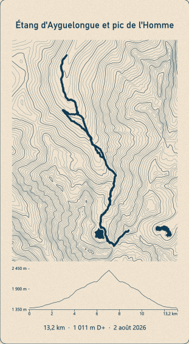 | 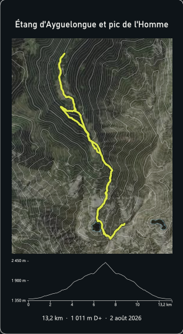 | 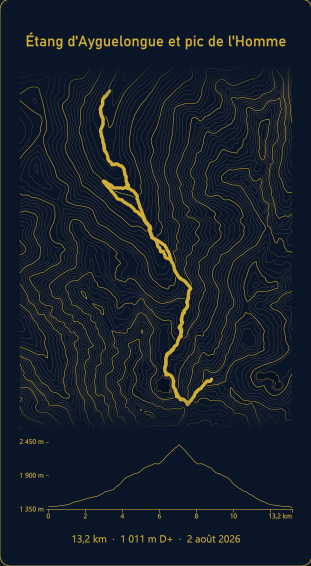 |

gpx2map is one of three tools sharing the same engine ([gpx2core](https://github.com/YannickRiou/gpx2core),
included here as a git submodule):

- [gpx2engraving](https://github.com/YannickRiou/gpx2engraving) — the same plate as a laser-ready SVG.
- **gpx2map** — the plate as a themed picture.
- [gpx2anim](https://github.com/YannickRiou/gpx2anim) — the plate animated as a GIF or MP4.

The content and the layout options are those of gpx2engraving: same title, same statistics,
same contours, same plate shapes. Only the output differs.

## Requirements

- **Windows with QGIS** (3.28 or newer): the script runs with the Python bundled with QGIS,
  which has numpy, scipy, shapely, pyproj, contourpy, fontTools, matplotlib and Pillow.
  `gpx2map.bat` finds it. Any Python 3.10+ with those packages works too.
- Internet access for the IGN elevation model (cached in `cache/`) and, with the `satellite`
  theme, the orthophoto. Coverage: France (IGN Géoplateforme open data, no key).

```bash
git clone --recursive https://github.com/YannickRiou/gpx2map.git
```

Already cloned without `--recursive`? Run `git submodule update --init` to fetch `core/`.

## Usage

```bat
gpx2map.bat hike.gpx -t "Pic de Cagire"                          :: hike_wood.png
gpx2map.bat hike.gpx -t "Pic de Cagire" --lang fr --summit --theme satellite
gpx2map.bat hike.gpx -t "Pic de Cagire" --theme wood,ink,noir     :: one PNG per theme
gpx2map.bat hike.gpx -t "Pic de Cagire" --theme all --dpi 150
gpx2map.bat day1.gpx day2.gpx -t "Col de Joclar" --format square --theme topo -o joclar.png
gpx2map.bat --list-themes
```

The PNG goes next to the first GPX as `<name>_<theme>.png` unless `--out` is given. The
picture has the size of the plate (`--max-size`, default 20 cm) at `--dpi` (default 300).

Everything gpx2engraving accepts works here: `--title`, `--summit`, `--lang`, `--format`,
`--max-size`, `--max-height`, `--size W H`, `--interval`, `--track-smooth`, `--despike`,
`--distance`, `--ascent`, `--date`, `--duration`, `--show-duration`, `--profile-fill`,
`--water osm`... see `gpx2map.bat --help` or the
[gpx2engraving README](https://github.com/YannickRiou/gpx2engraving#options). Keep the title
and `--lang` in the same language: the statistics line follows `--lang`.

### Picture options

| Option | Default | Effect |
|---|---|---|
| `--theme` | `wood` | theme(s), comma-separated, or `all` |
| `--dpi` | 300 | resolution; the plate size in mm is kept |
| `--out`, `-o` | | output file (single theme) |
| `--list-themes` | | list the themes and exit |

### Colours

Any colour of the theme can be overridden. Values are `#RRGGBB` (or `#RRGGBBAA`), and
`none` drops a fill:

```bat
gpx2map.bat hike.gpx -t "Pic de Cagire" --theme noir --track-color #DBE64C --bg-color #113B54 --contours-color #BBD1FF
gpx2map.bat hike.gpx -t "Pic de Cagire" --theme satellite --water-color none --set sat_dim=0.4
```

| Option | Element |
|---|---|
| `--bg-color` | plate background |
| `--text-color` | title, statistics, labels |
| `--track-color` | the track |
| `--contours-color` / `--index-color` | contour lines / index contours |
| `--water-color` / `--water-edge-color` | lake fill (`none` = outline only) / lake outline |
| `--profile-color` / `--curve-color` | profile axes and ticks / profile curve |
| `--frame-color` | plate outline |
| `--set KEY=VALUE` | any other theme key: `fade` (0–1, poster fade of the map edges), `grain` (paper grain), `sat_dim` (darkening of the orthophoto), `contours_alpha`, `index_alpha`, `water_alpha`, `track_halo`, `map_bg`, `satellite`, `dark` |

## Themes

Light, paper-like:

| | | |
|---|---|---|
| `wood`  | `paper` 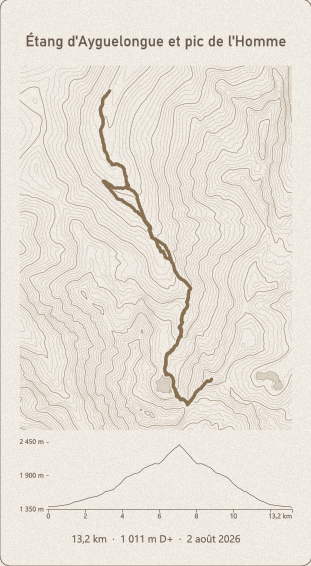 | `ink` 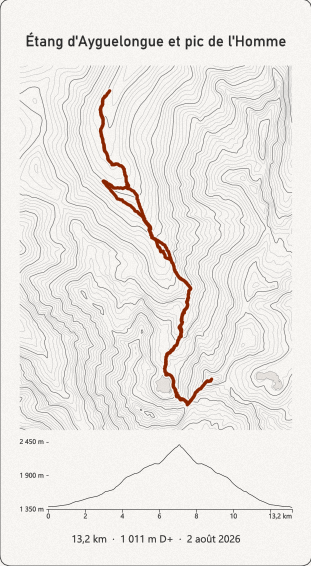 |
| `topo` 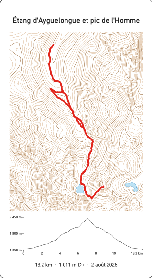 | `monoblue` 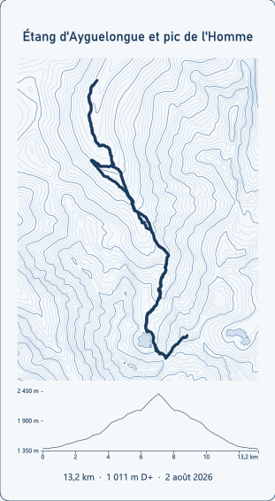 | `pastel` 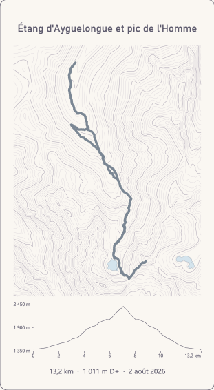 |
| `forest` 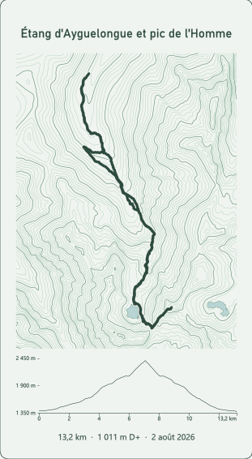 | `ocean` 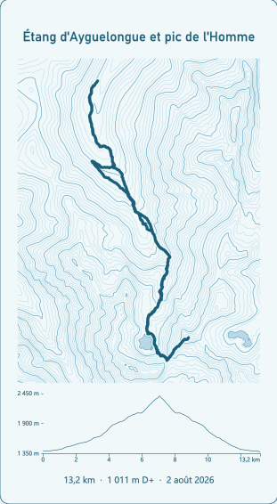 | `terracotta` 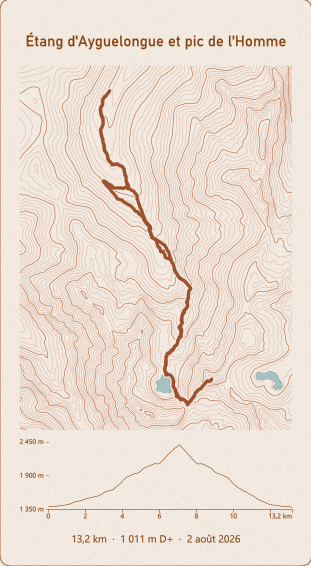 |
| `copper` 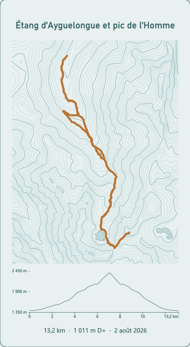 | `sunset` 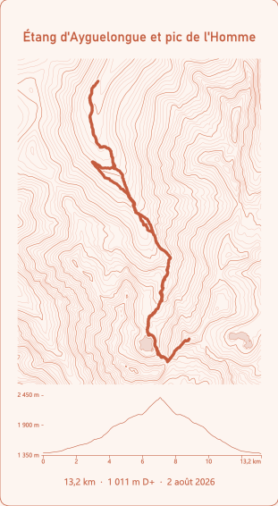 | `autumn` 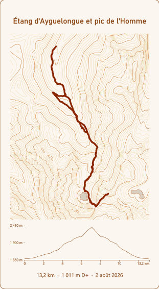 |

Dark posters and realistic:

| | | |
|---|---|---|
| `noir` 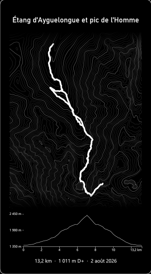 | `midnight`  | `blueprint` 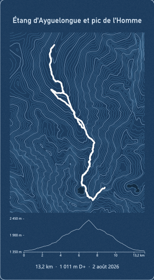 |
| `emerald` 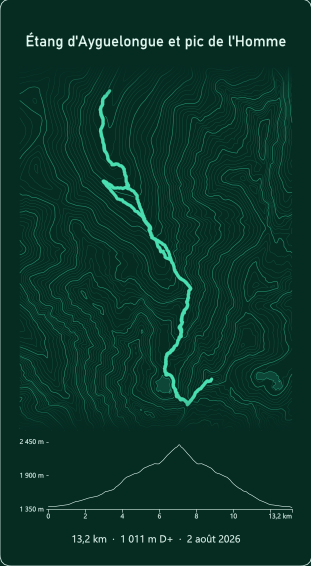 | `neon` 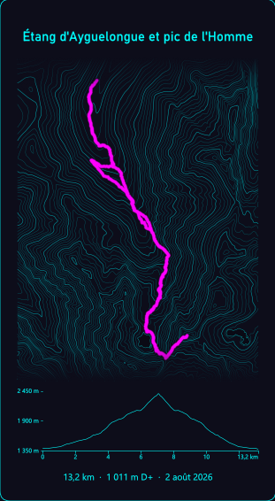 | `satellite`  |

`satellite` puts the IGN orthophoto (BD ORTHO) under the contours, slightly darkened so the
white contours and the chartreuse track stay readable; lakes are only outlined since the real
water is visible. The other palettes follow the naming of
[maptoposter](https://github.com/originalankur/maptoposter). Themes are defined in
`core/render.py`; adding one is a single `theme(...)` line.

## Data sources

- Elevation: IGN RGE ALTI 5 m (Géoplateforme WMS-Raster).
- Lakes: IGN BD TOPO (WFS), or OpenStreetMap with `--water osm`.
- Orthophoto: IGN BD ORTHO (`ORTHOIMAGERY.ORTHOPHOTOS`).

## Licence

MIT.
